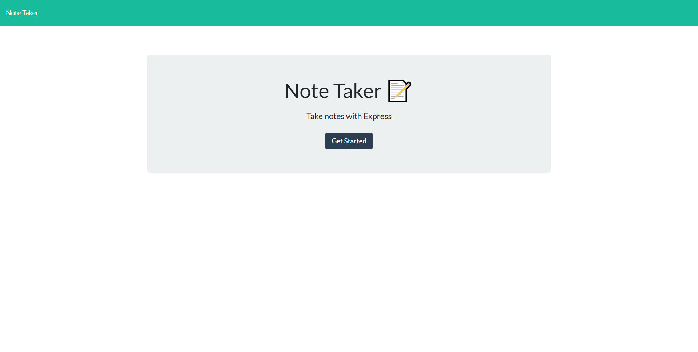
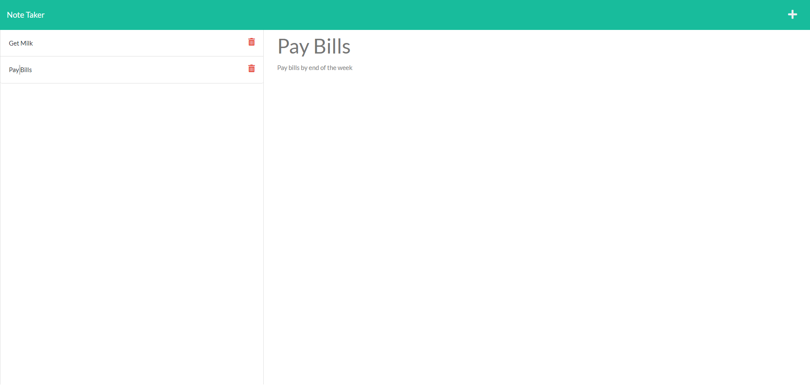

# Note Taker

## Table of Contents
1. [Description](#description)
2. [Visuals](#visuals)
3. [Usage](#usage)
4. [Resources](#resources)

## Description
This is an Express app designed to create, save, and delete notes with a title and description. The app is deployed on Heroku and uses backend functionality to maintain a database of notes on the server.

## Usage
- Click the "Get Started" button
- Enter a title and description for your note
- Click the save icon in the top right to save your note
- Click the plus icon in the top right to create a new note
- Click on a note in the sidebar on the left to view a saved note
- Click the trash can icon on a saved note to delete that note

## Visuals

## Resources
- [Live Site](https://jfox-note-taker.herokuapp.com/)
- [Online Repository](https://github.com/JtheFox/note-taker)
